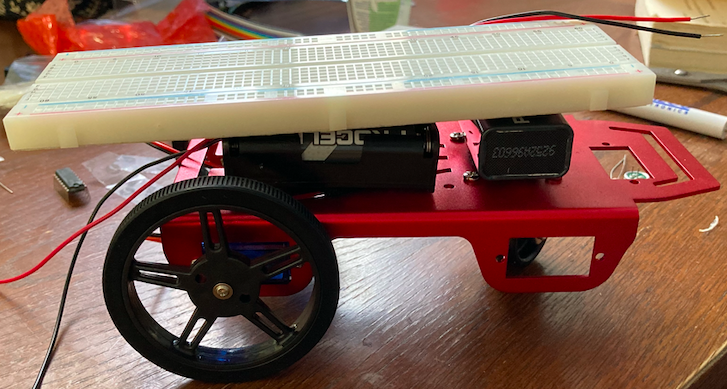
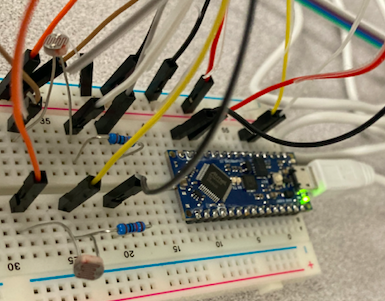

# The Life of of my Robot -- TOTO

To check out the website on Github, head over to my repository on [here](https://github.com/raghav2956/Cornell-University-ECE3400)

# Week 1

### Overview
In week 1, we put together Toto's structural frame and got familiar with the Arduino, the microncontroller that is supposed to act
as her brains. Other things involved ->

1. Getting familiar with the Photoresistors that would act as Toto's 'eyes'.
2. Playing around with the Analog to Digital converter on the arduino to read the values off the photoresistors. We talked about the 
   significance of the reference voltage, the sampling rate and the resolution.

### Challenges
1. It was a little challenging to figure out how to use the photoresistors. We had to dig into the datasheet, make a voltage divider
   circuit and test the sensors out before using it as Toto's eyes.
2. It was fun to understand, in more detail, how the ADC on the Arduino works and what happens behind the scenes when we do an 
   AnalogRead('Pin').

## Toto at Birth
There is an aluminium frame which has two DC motors as wheels. The batteries will eventually power the Arduino and the motors -- seperate
power has been provided since the motors will consume a non-trivial amount of power. The breadboard on top will house all the circuitry.

## Toto's Eyes
A not-so-pretty prototype of the 'vision' of the robot. The two photoresistors on either side respond to light by changing their resistance, 
providing an analog measurement on the basis of which the motors will be controlled.  

# Week 2

### Overview 
In week 2, I substantially increased the functionality of Toto's life. He can move now and respond to light -- rotating in position if there 
he is confused (lights are dim) and following the light when it hits either of his eyes. Some details involved ->

1. Playing around with the ADC registers to find prescalar values that influenced the ADC clock which influenced sampling rate. 
2. Incorporating the H-Bridge as the controller to the motors. The IC took inputs from the Arduino and its output fed into the motors. The 
   main function of the H-Bridge is to control the direction of rotation of the DC motor using the digital inputs given by the Arduino.
3. Tinkering around to understand the PWM signal from the Arduino (functionality, syntax and values) that would control the motors via the H-Bridge. 
   I had to try several values of the PWM pins to figure out what made TOTO rotate, go in a straight line, etc.

## Toto Reacts to Light
Click the image below to see the circuit in action!!

