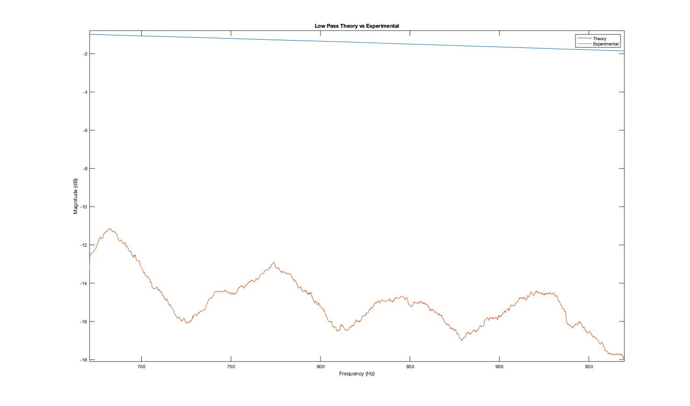

# The Life of of my Robot -- TOTO

To check out the website on Github, head over to my repository on [here](https://github.com/raghav2956/Cornell-University-ECE3400)

# Lab 1

### Overview
In week 1, we put together Toto's structural frame and got familiar with the Arduino, the microncontroller that is supposed to act
as her brains. Other things involved ->

1. Getting familiar with the Photoresistors that would act as Toto's 'eyes'.
2. Playing around with the Analog to Digital converter on the arduino to read the values off the photoresistors. We talked about the 
   significance of the reference voltage, the sampling rate and the resolution.

### Challenges
1. It was a little challenging to figure out how to use the photoresistors. We had to dig into the datasheet, make a voltage divider
   circuit and test the sensors out before using it as Toto's eyes.
2. It was fun to understand, in more detail, how the ADC on the Arduino works and what happens behind the scenes when we do an 
   AnalogRead('Pin').

## Toto at Birth
There is an aluminium frame which has two DC motors as wheels. The batteries will eventually power the Arduino and the motors -- seperate
power has been provided since the motors will consume a non-trivial amount of power. The breadboard on top will house all the circuitry.

## Toto's Eyes
A not-so-pretty prototype of the 'vision' of the robot. The two photoresistors on either side respond to light by changing their resistance, 
providing an analog measurement on the basis of which the motors will be controlled.  

# Lab 2

### Overview 
In week 2, I substantially increased the functionality of Toto's life. He can move now and respond to light -- rotating in position if there 
he is confused (lights are dim) and following the light when it hits either of his eyes. Some details involved ->

1. Playing around with the ADC registers to find prescalar values that influenced the ADC clock which influenced sampling rate. 
2. Incorporating the H-Bridge as the controller to the motors. The IC took inputs from the Arduino and its output fed into the motors. The 
   main function of the H-Bridge is to control the direction of rotation of the DC motor using the digital inputs given by the Arduino.
3. Tinkering around to understand the PWM signal from the Arduino (functionality, syntax and values) that would control the motors via the H-Bridge. 
   I had to try several values of the PWM pins to figure out what made TOTO rotate, go in a straight line, etc.

## H-Bridge Circuit 
The internal circuit looks messy but hey, did you think your human biology is any simpler ?! I am playing god here.

## Toto Reacts to Light
To watch Toto in action click [here](https://youtu.be/HeyBRctOXM4)

# Lab 3
Considering Lab 3 was a significantly longer lab, it was divided into three 1 week modules. The weekly tasks were less daunting to tackle and allowed us to
stay on track to finish the whole lab by the deadline.

## Week 1 Overview
In week 1, we first learnt how to use LTSpice to simulate electrical circuits and model their characteristics. We simulted a low pass and a high pass filter, obtained their Bode Plots and found their cutoff frequencies. We were then tasked with building a microphone circuit that could listen for and transmit auditory data (specifically a note of 500 Hz) into the Arduino. Using the on board Analog to Digitial Converter, we sampled the incoming analog data, discretized it and transmitted it to Matlab. Using Matlab, we performed a Fourier transformation on the Arduino data and obtained a freqeuncy spectrum, which when plotted, yielded a peak at the note originally played. 

### Bode Plot for Low Pass Filter

### Bode Plot for High Pass Filter

### Week 1 Challenges
1. One of the foremost challenges in using the microphone circuit was that our microphone was not of a very high quality and picked up a lot of noise along with
   the sound signal. There were many reasons for this noise -- 1/f noise, the 60Hz flickering noise from electronic applicances and finally the current flowing        through the wires on the breadboard itself. Due to this the spectrum obtained was very noisy and one had to really zoom in to find the peak at 500 Hz. We also      had to turn up the laptop volume to its highest and keep the microphone really close to the speakers
2. Setting up the ADC in freerun mode was also a bit tricky because one had to get familir with the ADC documentation in order to correctly set the ADC registers.
   I, particularly, had issues with finding the right analog pin declaration. For example, AIN3 on the arduino pinout is actually mapped to PORTD.PIN0CTRL instead      of PORTD.PIN3CTRL. This confused me for a while.
   
## Week 2 Overview
Week 2 was praticularly heavy because we had a lot of subtasks in the same week. To begin with, we first improved the microphone circuit by adding an LM358 op-amp amplifier. Upon amplification, the 500 Hz peak became much clearer but the peak was a little shifted ahead of the 500Hz mark like so ->

Once the output from the microphone was amplified, we were tasked with passing the output through a low pass and high pass filter seperately. The goal was implement and observe the bhaviour of a real life filter as it is applied on an incoming sound signal and to then observe the implications on the Fourier Spectrum. Unfortunately the filters didn't behave as expected (due to the noise, again) and hence we could only approximate the effects of the filter on the actual signal. 

Here are two plot depicting the superimposition of the expected behaviour of the filter (obtained from the Bode Plot) and the real behaviour on the 500Hz sound signal. This is all plotted in Matlab. The LTSpice data (magnitude and phase) is first imported into a google sheet, cleaned and then read via Matlab. To observe the data, we zoomed in around the 500 Hz - 1K Hz mark since that is our frequency of interest. 

### Low Pass superimposition

### High Pass superimposition

As you can see, while the y-axis scales are different, there is a general trend that both, the theoretical and experimental data show. The delta magnitude is around 3dB in the experimental data as it ranges from 500Hz to 1KHz.

Finally, we were required to build a bandpass filter that, theoretically, attenuated frequencies below 500Hz and above 1KHz. The hope was that all the noise around the signal of interest would be eliminated to a great extent using the bandpass filter, however, that didn't quite happen since the bandpass filter, itself, was not spared from the perils of surrounding noise and the low quality of the op-amps used. The LTSpice simulations for the Bandpass filter looked like so ->

## BandPass Filter LTSpice Schematic

## Bode Plot for BandPass Filter

Upon actually implementing the bandpass filter, we encountered the same issues we faced with the low and high pass filters. 1/f noise, 60Hz flicker noise and other current induced noise on the breadboard led to less than ideal results and at most, we could observe a rough similiarity between theory and actual experiment.

### Band Pass superimposition

### Week 2 Challenges
1. There were considerable hardware challenges in Week 2 because in addition to the H-Bridge and the Arduino, I now also had three op-amps (one for the microphone    filter and two for the bandpass filter) on our breadboard. This meant that my breadbored was very cramped for space and it required some thinking in order to      fit everything gracefully. I had to make sure that all resistors, capacitors and op-amp pins were sufficiently isolated so as to not short themselves out. 
2. The main challenges on the software side were related to the experimental frequency output out of the bandpass filter. Due to the various noise sources (close      proximity wires, 1/f noise, 60Hz flickering noise), the observed output out of the low-pass, high-pass and bandpass filters was nowhere close to the                experimental results. I tried multiple things -- different positions for the circuit relative to the computer speakers, different lengths of time for which the    sound played, different frequencies etc -- in order to get close to simulation results but the above pictures are the best approximation I could manage. 

## Week 3 Overview
In week 3, we were tasked with shifting all the Matlab FFT processing to the Arduino. We also bypassed the filtering in order to eliminate all the noise sources that affect the sound signal as it travels from the microphone to the filters to the Arduino and finally to Matlab. We used a FFT library made for the Arduino and used an ISR to read values off the ADC buffer. Essentially, we instantiated a 256 element array that got filled with ADC samples as soon as the Arduino reset. A timer set to overflow every 0x19 ticks (with main clock frequency = 0x19 and a prescaler of 256) ensured that the ISR read a sample every 0.41667 seconds which then became our sampling period. I also made sure to store the register values for the ADC before changing it to **free-run mode** because that way, when in the future I need to go from reading the ADC to reading the photoresistors, I will not lose the ADC register values that enable me to read the photoresistors. 

Finally, once the 256 element array was full, like earlier labs, I shifted the ADC values down by 512 and stored them in a 16 bit short to go from unsigned to signed ADC values. This was done because the FFT library needs to have analog signals oscillating around 0 while the raw ADC values go from 0 to 1024. In the last step, I stored the 256 elements in a new array called _fft_input_ where the odd indices held 0 (imaginary part of the signal) and the even indices held the corresponding shifted and signed ADC value (real part of the signal). This was done since the FFT library needs such an array to do the fft processing.  

Below are the frequency spectrum images for certain frequencies ->

### 500 Hz

### 700 Hz

### 900 Hz

### Week 3 Challenges
1. Because Prof. Poitras allowed us to bypass the filters for the final part of lab, there were no considerable hardware challenges in Week 3. The main challenges related to the software, whereby we had to intelligently code the setup, loop and ISR part of the sketch. I, personally, found an interesting challenge in figuring out the timer overflow value for the TCA timer because it involved understanding the math behind a properly functioing ISR. I had to dig into the TCA datasheet and understand a few things -- how the TCA prescaler affects the overflow calculation, what certain code lines mean etc. 

## Week 4 Overview
Week 4 was our final week as configured our robots to perform two demos that required us to put together all that we had learned over the semester. In addition to leveraging our past skills, we also learned how to use an ultrasonic sensor that was deployed for obstacle detection. 

### Demo 1 Overview
For the first demo, the robot had to continuosly run the FFT algorithm before detecting a 550Hz frequency that we played to it. The tricky part was that the robot had to seperate this frequency out from a couple different frequencies. This was done by checking the appropriate bins the final FFT output array. Once the 550Hz frequency was detected, the robot turned in place, recognizing two obstacles that were kept around it. As soon as it recognized these obstacles, the onboard LED went on and the robot was required to stop after one complete rotation. 

## Demo 1 Video
To watch Demo 2 click [here](https://youtu.be/1Hbusb-XvLs)

## Demo 1 Challenges
1. The main challenge in Demo 1 was to continously run the FFT algorithm and subsequently alter the main loop control flow in order to skip the FFT algorithm once the desired frequency was detected. 
2. While we were suggested to use the millis() and micros() functions to aid with control flow, I preferred to use flags to do the same. This required some further brainstorming. 

### Demo 2 Overview
Demo 2 was far more challenging. Here, our robots were supposed to navigate through a basic maze, avoiding certain obstacles and performing some other sequential functions. Via the photosensors, our robot relied on a light source to navigate through the maze and was supposed to contain logic which would prevent it from bumping into the obstacles. The main challenges in this demo came from the rules that our robot was supposed to obey -->

1.When facing the first obstacle, the onboard LED should be on and if light is shined on the left side of the robot, the robot should not move. 
2.When facing the second obstacle, the onboard LED should be off.
3.When facing the third obstacle, the onboard LED should be on.

### Demo 2
To watch Demo 2 click [here](https://youtu.be/QEZMhMHqUf8)

## Demo 2 Challenges
1. Demo 2 was tricky because the rules mentioned above meant that I had to make different code blocks/control flow for each obstacle. It was also hard to keep track of the obstacles because the ultrasonic sensor would not allow to simply update a counter for each obstacle. Hence, I had to use a complex combination of flags to keep track of the obstacles and accordingly run different code blocks for different code blocks. 

